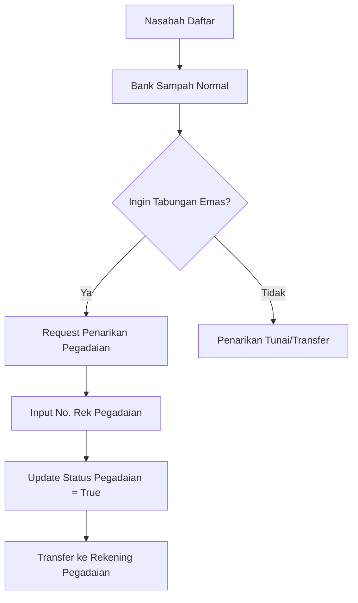

# RINGKASAN SISTEM BANK SAMPAH

## 📋 Deskripsi Umum

Sistem Bank Sampah adalah aplikasi manajemen yang dirancang untuk mengelola operasional bank sampah, termasuk pendaftaran nasabah, penyetoran sampah, transaksi keuangan, dan integrasi dengan program tabungan emas Pegadaian.

---

## 🏗️ Arsitektur Sistem

### Platform Teknologi

- **Framework**: Laravel 11 dengan Filament 3 (Admin Panel)
- **Database**: SQLite/MySQL
- **Authentication**: Laravel Sanctum
- **Export**: alperenersoy/filament-export dengan Spatie SimpleExcel

### Komponen Utama

1. **Admin Panel** - Interface manajemen untuk operator
2. **Database Layer** - Penyimpanan data dengan relasi kompleks
3. **Observer Pattern** - Automasi transaksi keuangan
4. **Export System** - Laporan dan export data

---

## 🗂️ Struktur Data Utama

### 1. **Nasabah (Rekening)**

```php
- ID: ULID unik
- Data Pribadi: NIK, Nama, Alamat, Gender, Tanggal Lahir
- Kontak: Telepon (opsional)
- Pendidikan: Level pendidikan terakhir
- Alamat: Dusun, RW, RT
- Status Pegadaian: Boolean + No. Rekening Pegadaian
- Saldo: Balance (rupiah) + Points Balance
- Audit: Created/Updated timestamps, User pembuat
```

### 2. **Jenis Sampah (Sampah)**

```php
- Jenis Sampah: Kategori sampah (plastik, kertas, dll)
- Saldo per Kg: Nilai rupiah per kilogram
- Poin per Kg: Nilai poin per kilogram
- Total Berat Terkumpul: Akumulasi berat sampah
```

### 3. **Transaksi Setor Sampah**

```php
Header (SetorSampah):
- Rekening ID: Reference ke nasabah
- Total Saldo Dihasilkan: Agregat nilai rupiah
- Total Poin Dihasilkan: Agregat nilai poin
- Jenis Setoran: 'setor' atau 'donasi'

Detail (DetailSetorSampah):
- Sampah ID: Reference ke jenis sampah
- Berat: Berat dalam kilogram
- Otomatis: Saldo & poin dihitung berdasarkan tarif
```

### 4. **Sistem Transaksi Keuangan**

```php
Saldo Transactions:
- Type: 'credit' (penambahan) atau 'debit' (pengurangan)
- Amount: Nilai transaksi
- Polymorphic: Terhubung ke SetorSampah/WithdrawRequest

Poin Transactions:
- Amount: Nilai poin (selalu positif untuk penambahan)
- Polymorphic: Terhubung ke sumber transaksi
```

### 5. **Penarikan Dana (WithdrawRequest)**

```php
- Jenis: 'tunai', 'transfer', 'pegadaian'
- Amount: Jumlah penarikan
- Status Pegadaian: Registrasi baru atau existing
- No Rekening Pegadaian: Untuk jenis pegadaian
```

---

## 🔄 Alur Proses Bisnis

### A. **Pendaftaran Nasabah**

1. Admin input data pribadi nasabah
2. Sistem generate nomor rekening otomatis
3. Saldo awal = 0, Poin awal = 0
4. Status pegadaian default = false

### B. **Proses Setor Sampah**

```
1. Admin pilih rekening nasabah
2. Input detail sampah (jenis + berat)
3. Sistem kalkulasi otomatis:
   - Saldo = Berat × Saldo_per_kg
   - Poin = Berat × Poin_per_kg
4. Database Transaction:
   - Insert SetorSampah (header)
   - Insert DetailSetorSampah (detail)
   - Insert SaldoTransaction (credit)
   - Insert PoinTransaction (credit)
   - Update balance di rekening
   - Update total_berat_terkumpul di master sampah
```

### C. **Proses Penarikan Dana**

```
1. Admin input permintaan penarikan
2. Validasi saldo mencukupi
3. Database Transaction:
   - Insert WithdrawRequest
   - Insert SaldoTransaction (debit)
   - Decrement balance di rekening
4. Khusus penarikan pegadaian:
   - Update status_pegadaian = true
   - Simpan no_rek_pegadaian
```

### D. **Integrasi Pegadaian**

- Nasabah bisa mendaftar tabungan emas
- Penarikan langsung ke rekening pegadaian
- Status tracking di sistem bank sampah

---

## 🔧 Fitur Utama

### Dashboard & Monitoring

- ✅ Dashboard overview statistik
- ✅ Laporan transaksi real-time
- ✅ Export data ke Excel/CSV/PDF

### Manajemen Nasabah

- ✅ CRUD data nasabah lengkap
- ✅ Tracking saldo dan poin
- ✅ History transaksi per nasabah
- ✅ Status integrasi pegadaian

### Transaksi Sampah

- ✅ Input setoran multi-jenis sampah
- ✅ Kalkulasi otomatis saldo & poin
- ✅ Validasi berat dan jenis sampah
- ✅ Support setoran donasi (tanpa rekening)

### Sistem Keuangan

- ✅ Double-entry bookkeeping sederhana
- ✅ Audit trail lengkap semua transaksi
- ✅ Validasi saldo sebelum penarikan
- ✅ Reversal otomatis saat delete/restore

### Pelaporan & Export

- ✅ Export data nasabah dengan filter kolom
- ✅ Format Excel dengan formatting khusus
- ✅ Preview sebelum export
- ✅ Multiple format (XLSX, CSV, PDF)

---

## 🔐 Keamanan & Validasi

### Data Integrity

- **Unique Constraints**: NIK, No. KK, No. Rekening Pegadaian
- **Soft Deletes**: Data tidak benar-benar terhapus
- **Database Transactions**: Konsistensi data terjamin
- **Observer Pattern**: Automasi business logic

### Access Control

- **Authentication**: Laravel Sanctum
- **Role-based**: Admin panel dengan Filament
- **Audit Trail**: User tracking di setiap transaksi

### Validasi Input

- **NIK**: 16 digit numerik, unik
- **No. KK**: 16 digit numerik, unik
- **Berat Sampah**: Numerik positif
- **Saldo Penarikan**: Tidak boleh melebihi balance

---

## 📊 Perhitungan & Business Logic

### Formula Dasar

```php
// Setor Sampah
Saldo = Berat_Sampah × Saldo_per_kg
Poin = Berat_Sampah × Poin_per_kg

// Current Balance (Real-time)
Current_Balance = Σ(Credit_Transactions) - Σ(Debit_Transactions)
Points_Balance = Σ(Poin_Transactions)
```

### Automation Rules

1. **Setor Sampah**: Otomatis credit saldo & poin
2. **Penarikan**: Otomatis debit saldo
3. **Delete/Restore**: Otomatis reversal transaksi
4. **Update Data**: Otomatis koreksi dengan selisih

---

## 📈 Laporan & Analytics

### Data Export Features

- **Rekening Nasabah**: Data lengkap dengan status pegadaian
- **Transaksi Setor**: Detail sampah dan nilai transaksi
- **Transaksi Penarikan**: History penarikan per nasabah
- **Custom Filters**: Pilih kolom sesuai kebutuhan

### Format Output

- **Excel**: Formatting otomatis, column width optimal
- **CSV**: Delimiter kustomisasi
- **PDF**: Template printable

---

## 🔄 Workflow Integrasi Pegadaian



---

## 🚀 Pengembangan & Maintenance

### Code Quality

- **Laravel Best Practices**: MVC pattern, Service classes
- **Database Design**: Normalized, dengan proper indexing
- **Error Handling**: Comprehensive exception handling
- **Documentation**: Inline comments dan docblocks

### Scalability Considerations

- **Database**: SQLite untuk development, MySQL untuk production
- **Caching**: Laravel cache untuk performance
- **Queue**: Background jobs untuk operasi berat
- **API Ready**: Struktur mendukung REST API

---

## 📞 Support & Dokumentasi

### File Penting

- `PanduanMigrasi.txt`: Dokumentasi struktur database
- `Prompting.md`: Panduan development
- `README.md`: Setup dan instalasi

### Key Models

- `app/Models/Rekening.php`: Core nasabah model
- `app/Models/SetorSampah.php`: Transaksi setoran
- `app/Models/WithdrawRequest.php`: Penarikan dana
- `app/Observers/`: Business logic automation

---

**Sistem Bank Sampah** - Solusi digitalisasi manajemen bank sampah yang terintegrasi dengan sistem keuangan modern dan program tabungan emas.

_Dikembangkan dengan Laravel + Filament untuk kemudahan penggunaan dan maintainability._
